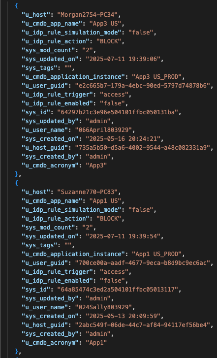

# ServiceNow CMDB Ingest for Identity Protection

## 1. Executive Overview
This Foundry application integrates CrowdStrike's Identity Protection (IDP) with ServiceNow's Configuration Management Database (CMDB) to automatically manage access policies. The application bridges the gap between ServiceNow access approvals and IDP policy enforcement, eliminating manual synchronization processes. It ensures users can only access servers and applications they're explicitly authorized to access through ServiceNow requests, effectively preventing lateral movement within the network.

Target users include organizations that use both CrowdStrike IDP and ServiceNow CMDB for access management, particularly those concerned with maintaining strict access controls while streamlining administrative workflows.

## 2. Application Capabilities
- **Automated Policy Synchronization**: Automatically creates IDP policies based on ServiceNow CMDB access approvals
- **Initial Bulk Synchronization**: Performs "Cold Boot" processing of existing ServiceNow CMDB access relationships
- **Reconciliation Logic**: Implements periodic checks to verify ServiceNow CMDB and IDP policies remain in sync
- **Policy Management**: Handles the creation, and effective updating of IDP policies despite API limitations

## 3. Installation Guide
### Prerequisites
- Active CrowdStrike subscription with Identity Protection module
- ServiceNow instance with CMDB implementation
- Service account with appropriate permissions for both platforms
- Object GUIDs for Active Directory users and machines must be available in CMDB

### Installation Steps
1. Deploy the application through CrowdStrike Foundry
2. Test and set GET__api_now_table_tablename operation's response schema
3. In ServiceNow to IDP policy rules synchronizer workflow, ensure the ```write to log repo``` action has the right foundry app id.
4. Release the application.
5. Go to App catalog and install the application.
6. Configure ServiceNow connection settings:
    - ServiceNow instance URL
    - Service account credentials
7. Configure Workflow parameters.
8. Execute Initialize or Reset checkpoint-LatestSysUpdatedOn workflow
9. Execute ServiceNow to IDP policy rules synchronizer workflow

## 4. User Guide
### ServiceNow CMDB Table
There should be an access table created that returns records similar to the following via Table API response. The records in this table serve as the source of truth for creating IDP Policy rules.



### Foundry Artifacts
The following artifacts are used in this app.

#### Authorization
Authorization artifact configures all required scopes for the app to interact with various Falcon services. It establishes the security boundaries and permissions needed for proper operation.

#### API Integration
The ServiceNow CMDB Table API spec is implemented as an API Integration artifact. It uses basic authorization for accessing the ServiceNow API, which can be customized during app installation to match customer environments.


#### Collection
The application maintains synchronization state by storing checkpoint details after each sync operation. These checkpoints include the last sync time and the last updated timestamp of the most recently processed record. During subsequent synchronizations, only records updated since the checkpointed time are processed, ensuring efficient operation.

#### Function
The core processing logic is implemented in a Python function that handles records received from the ServiceNow CMDB Table API. This function efficiently creates or updates Falcon IDP Policy rules for each application name in the ServiceNow CMDB records. The function is parametrized to take ServiceNow CMDB column names and Falcon IDP Policy rule parameters as input. The function code is customizable to accommodate specific customer requirements.

#### Workflows

Workflow configuration to be done during app installation.


##### Initialize or Reset checkpoint-LatestSysUpdatedOn
This workflow must be executed at least once after installation to establish the initial checkpoint. It can also be triggered manually to reset the checkpoint time when records need to be resynchronized from a specific point in time. The workflow is parametrized and the default checkpoint time is set to 1970-01-01 00:00:00 which can be updated before triggering this workflow.

##### ServiceNow to IDP policy rules synchronizer
This workflow serves as the main execution engine of the application, orchestrating all artifacts to perform the synchronization process. Upon completion of each run, it writes a summary record to LogScale that can be leveraged to create NG-SIEM dashboards and alerts for monitoring synchronization status.


The records written to LogScale by the app can be fetched as shown below from NG SIEM.


## 5. Development Environment
### Development Stack
- CrowdStrike Foundry development framework
- Direct REST API integration with IDP via Function (no existing Fusion actions used)
- ServiceNow API integration

### Testing Environment
- Developed and tested against:
  - CrowdStrike Identity Protection module
  - ServiceNow CMDB standard implementation
  - Test environment with simulated access request workflows

## 6. Customization & Enhancement
### Extension Points
  - ServiceNow CMDB table structure customization
  - The application is designed to be adaptable to customer-specific CMDB structures
  - Configuration options allow mapping to custom fields and tables

### Potential Enhancements
- Enhanced dashboard for monitoring policy synchronization status
- Support for additional access types beyond the initial implementation
- Custom approval workflows
- Handle deletion of access from ServiceNow CMDB
- Handle pagination in the ServiceNow Table API response

## 7. Technical Specifications
### Performance Considerations
- Initial synchronization performance depends on the volume of existing access relationships
- Ongoing synchronization designed for minimal impact on both platforms
- Recommended synchronization interval: hourly (configurable)

### Security Implementation
- Implements a restrictive security model (block all access except explicitly permitted connections)
- Requires least-privilege service accounts for both platforms
- All API communications use secure, authenticated connections


